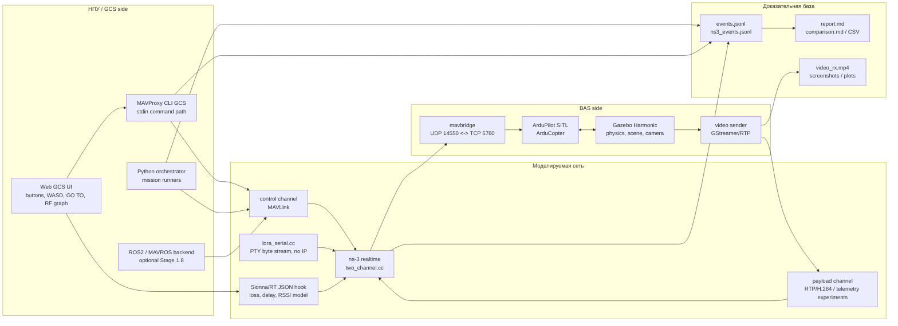

# BAS Prototype

Исследовательский прототип среды моделирования БАС: Gazebo + ArduPilot SITL +
MAVLink/MAVROS + ns-3 + Sionna RT + операторский Web GCS. Репозиторий закрывает
личную зону Физулина А.В. по моделированию каналов связи, MAVLink/MAVROS,
ns-3/Sionna и ручному управлению одним БАС.

Проект не является production autopilot stack. Это воспроизводимый стенд для
демонстрации, экспериментов и отчётных прогонов: полётная физика в Gazebo/SITL,
радиоканал в ns-3, полезная нагрузка через отдельный payload-канал, логи в JSONL
и отчёты в Markdown.

## Текущий статус

| Блок | Статус | Что реально есть |
|---|---|---|
| Gazebo + ArduPilot SITL | Готово | Миссия ArduCopter в Gazebo Harmonic через `ardupilot_gazebo` |
| ns-3 control/payload channels | Готово | Два TAP-канала: MAVLink control и RTP/H.264 payload |
| WiFi / degraded LoRa-like IP profiles | Готово | `wifi_good`, `degraded_lora`, outage/loss/delay/jitter/goodput |
| Видео через payload | Готово | `videotestsrc` и режим реальной Gazebo POV camera, MP4 на приёмнике |
| Сравнение WiFi vs LoRa | Готово | Side-by-side Markdown + CSV через analyzer |
| LoRa через Serial Port | Готово | PTY + dual-socat + ns-3 PHY-calibrated byte stream без IP в радиопетле |
| MAVROS backend | Готово | ROS2/MAVROS bridge как альтернативный backend к `pymavlink` |
| Sionna RT | Готово | Offline radio map + dynamic JSON channel hook для ns-3 |
| Web GCS / ручное управление | Готово | Browser UI -> MAVProxy stdin -> ns-3 -> SITL/Gazebo |
| RF/LOS live demo | Готово | Препятствия в Gazebo и UI, LOS/NLOS, RSSI/loss/delay график |
| AirSim overlay | Не реализовано | Вне текущей закрытой зоны, оставлено в roadmap |
| Multi-UAV / swarm | Не реализовано | Вне текущей закрытой зоны, оставлено в roadmap |
| Полная ИССГР объектная БД/API | Не реализовано | Это шире личной зоны данного репозитория |

Матрица соответствия ТЗ: [docs/tz_compliance.md](docs/tz_compliance.md).

## Итоговая архитектура



Ключевая идея: **полётная физика и автопилот не подменяются сетевой моделью**.
Gazebo/SITL отвечают за движение БАС, ns-3 отвечает за свойства канала, а
оркестратор, MAVProxy или MAVROS выступают в роли НПУ/GCS.

## Основные режимы работы

### 1. Mission через ns-3 control channel

Автоматическая миссия через MAVLink/UDP, проходящая через `bas-ctrl-far`
namespace, ns-3 control TAP и `mavbridge` на стороне БАС.

```bash
sudo bash scripts/run_stage_1_5_1_mission.sh wifi_good
sudo bash scripts/run_stage_1_5_1_mission.sh degraded_lora
```

Результат: `logs/stage_1_5_1_mission_*/report.md`.

### 2. Mission + видео через payload channel

Добавляет RTP/H.264 видеопоток через отдельный payload-канал ns-3.

```bash
sudo bash scripts/run_stage_1_5_2_mission.sh wifi_good
sudo bash scripts/run_stage_1_5_2_mission.sh degraded_lora
```

Режим с бортовой Gazebo camera:

```bash
sudo env BAS_VIDEO_SOURCE=camera \
  bash scripts/run_stage_1_5_2_mission.sh wifi_good
```

Артефакты: `video_rx.mp4`, `video_tx.jsonl`, `video_rx.jsonl`, секция
`Видеопоток` в `report.md`.

### 3. Сравнение WiFi vs LoRa

```bash
sudo bash scripts/run_stage_1_6_compare.sh
```

Создаёт `logs/stage_1_6_<UTC>/comparison.md` и `comparison.csv`.

### 4. LoRa через Serial Port

Буквальный serial-path без IP-stack в радиопетле: host PTY -> ns-3 -> PTY ->
SITL serial TCP.

```bash
sudo bash scripts/run_stage_1_7_lora_serial.sh
```

Настройка PHY-параметров:

```bash
sudo env BAS_LORA_SF=9 BAS_LORA_DISTANCE_M=3000 \
  bash scripts/run_stage_1_7_lora_serial.sh
```

### 5. MAVROS backend

Альтернативный ROS2/MAVROS путь для миссии. `pymavlink` остаётся default для
основных сценариев, MAVROS включается отдельным runner'ом.

```bash
sudo bash scripts/run_stage_1_8_mavros.sh baseline_wifi
```

Документация: [docs/stage_1_8_mavros_plan.md](docs/stage_1_8_mavros_plan.md).

### 6. Sionna RT

Sionna используется для физически обоснованной радиокарты и dynamic channel
hook. Полный setup тяжёлый, потому что ставит отдельный Python environment.

```bash
bash scripts/setup_sionna.sh
sionna_env/bin/python scripts/export_scene_to_sionna.py
sionna_env/bin/python scripts/compute_radio_map.py --save-png
sudo bash scripts/run_stage_2_1_sionna.sh
```

Быстрый synthetic-путь без SITL/Gazebo:

```bash
bash scripts/run_stage_2_1_synthetic.sh
```

Артефакты: `radio_maps/iris_runway.npz`, `radio_maps/iris_runway.png`,
`logs/stage_2_1_synthetic_*/sionna_overview.png`.

### 7. Live Web GCS / RF demo

Самый наглядный режим для видео: открываются Gazebo GUI и браузерный пульт.
Команды идут через MAVProxy stdin, дальше через ns-3 control channel в SITL.

```bash
sudo bash scripts/run_stage_2_4_rf_demo.sh
```

После запуска открыть:

```text
http://127.0.0.1:8765/
```

Сценарий для демонстрации:

1. Нажать `TAKEOFF`.
2. Управлять `W/A/S/D` или кнопками на панели.
3. Нажать `NLOS PASS` или задать `GO TO N=80 E=45`.
4. На видео показать Gazebo-сцену с препятствиями и Web GCS: LOS/NLOS,
   RSSI, loss, delay и live-график.

`GO TO` использует `SET_POSITION_TARGET_LOCAL_NED` через MAVProxy `message`,
поэтому точка на карте трактуется как абсолютная локальная `N/E` цель, а не
как body-frame velocity.

## Структура репозитория

| Путь | Назначение |
|---|---|
| `configs/` | Сценарии, миссии, сетевые профили, MAVProxy init |
| `docker/` | Dockerfile'ы для SITL, Gazebo, ns-3, MAVROS, video |
| `orchestrator/` | Python orchestration, mission runners, MAVROS bridge |
| `analyzer/` | Метрики, Markdown-отчёты, сравнение прогонов |
| `ns3/scenarios/` | `two_channel.cc`, `lora_serial.cc`, LoRaWAN baseline |
| `gazebo/worlds/` | Gazebo worlds, включая RF demo scene |
| `scene/` | Mitsuba/Sionna scene XML |
| `radio_maps/` | Сохранённые Sionna radio maps |
| `scripts/` | Запуск стендов, setup, диагностика, визуализация |
| `web/gcs/` | Browser operator console |
| `video/` | RTP sender/receiver для payload channel |
| `docs/` | Архитектура, планы этапов, матрица ТЗ |
| `logs/` | Run artifacts; обычно gitignored |

## Артефакты прогона

Каждый runner создаёт `logs/<run_id>/`. Внутри обычно лежат:

| Файл | Что доказывает |
|---|---|
| `report.md` | Человеческий отчёт: flight, network, video/RF summaries |
| `events.jsonl` | События оркестратора/GCS/MAVLink |
| `ns3_events.jsonl` | События ns-3: tx/rx/drop/outage/channel updates |
| `mavproxy_stdout.log` | Что видел и отправлял MAVProxy |
| `operator_ui_manifest.json` | Конфигурация Web GCS run |
| `video_rx.mp4` | Принятый payload video |
| `comparison.md`, `comparison.csv` | Сравнение нескольких прогонов |

## Требования к окружению

Проверялось в Ubuntu/WSL2. Для большинства live-сценариев нужны:

- Docker + Docker Compose
- `sudo` для netns/TAP/veth setup
- Python virtualenv `.venv` с пакетами проекта
- WSLg/X11, если нужен Gazebo GUI
- отдельный `sionna_env`, если запускается Sionna RT pipeline

Перед тяжёлыми прогонами обычно достаточно:

```bash
sudo service docker start
docker compose build
```

Если порт Web GCS занят, остановить предыдущий runner через `Ctrl+C` в его
терминале и запустить сценарий заново.

## Честные ограничения

- Stage 2.4 реализован через **Web GCS + MAVProxy**: Browser -> MAVProxy
  stdin -> ns-3 -> SITL. QGroundControl не был acceptance-клиентом; его можно
  добавить отдельно поверх уже работающего MAVProxy/MAVLink контура.
- RF/LOS live demo в Web GCS использует детерминированную геометрию препятствий
  и пишет channel JSON для ns-3 polling. Это видео-friendly live model, а не
  полноценный real-time Sionna ray tracing в каждом кадре.
- Sionna RT часть реализована как offline radio map + dynamic JSON hook.
  Это достаточно для воспроизводимой демонстрации position-dependent loss/delay,
  но не является универсальным радиопланировщиком.
- Multi-UAV/swarm и AirSim overlay не реализованы в этом репозитории.
- Полная объектно-ориентированная ИССГР БД, REST/OGC API и обработка видовых
  данных относятся к более широкому грантовому контуру и здесь не закрываются.

## Документация

- [docs/architecture.md](docs/architecture.md) — итоговая архитектура и контуры
- [docs/tz_compliance.md](docs/tz_compliance.md) — матрица соответствия ТЗ
- [docs/stage_2_4_manual_gcs.md](docs/stage_2_4_manual_gcs.md) — Web GCS/MAVProxy
- [docs/stage_1_7_lora_serial_plan.md](docs/stage_1_7_lora_serial_plan.md) — LoRa Serial
- [docs/stage_1_8_mavros_plan.md](docs/stage_1_8_mavros_plan.md) — MAVROS backend
- [docs/stage_2_1_sionna_plan.md](docs/stage_2_1_sionna_plan.md) — Sionna RT
- [docs/stage_camera_regression.md](docs/stage_camera_regression.md) — Gazebo camera notes

## Короткая сводка для отчёта

Личная зона Физулина А.В. по текущей матрице закрыта: два канала связи,
MAVLink/MAVROS, ns-3/Sionna RT, LoRa Serial, видео payload, ручное управление
одним БАС и live RF/LOS демонстрация. Остаток относится либо к полной ИССГР
системе, либо к AirSim/Multi-UAV задачам за пределами текущей закрытой части.
