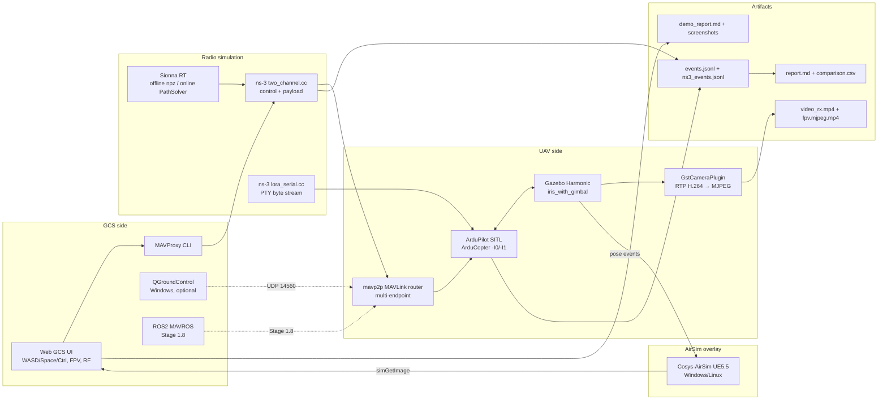

# BAS Prototype — стенд моделирования беспилотных авиационных систем


AI RAG DEEPWIKI DOCS https://deepwiki.com/AFETZ/bas

Воспроизводимый исследовательский стенд для моделирования БАС с фокусом на
**каналы связи, радиофизику, ручное управление и интерфейсы симуляторов**.
Закрывает зону Физулина А.В. по гранту ПВАТС УЛ САПР
(15/15 пунктов ТЗ + Stage 3/4 интеграционный backlog).

```
┌──────────────────────────────────────────────────────────────────────────┐
│ Browser Web GCS ─── MAVProxy/QGC ──── ns-3 control + payload ──── SITL  │
│       │                                       │              ↕          │
│       │                                       Sionna RT     ArduCopter  │
│       │                                       (live or                  │
│       │                                       offline)      ↕           │
│       └─── FPV overlay <───── camera <─── Gazebo physics + iris_with_g  │
│                                                              ↕          │
│                                                          Cosys-AirSim   │
│                                                          (overlay, UE5) │
│                    JsonFdmBridge: PWM → 6DOF + IMU/GPS → ArduPilot     │
└──────────────────────────────────────────────────────────────────────────┘
```

## 📚 С чего начать (навигация)

| Хочу… | Открыть |
|---|---|
| **Запустить демо, но не знаю какое** | `bash scripts/demo.sh` (интерактивное меню) |
| **Понять что за модуль, что показывает, с чем связан** | [docs/MODULE_MAP.md](docs/MODULE_MAP.md) |
| **Увидеть готовые цепочки модулей (рецепты)** | [docs/SCENARIOS.md](docs/SCENARIOS.md) |
| **Разобрать термины (ИССГР, SITL, LoS…)** | [docs/GLOSSARY.md](docs/GLOSSARY.md) |
| **Понять сайты в браузере** | [docs/ui_guide.md](docs/ui_guide.md) |
| **Что реально, а что заглушка** | [docs/LIMITATIONS.md](docs/LIMITATIONS.md) |
| **Полный каталог демо** | [docs/DEMOS.md](docs/DEMOS.md) |

## Что внутри

| Сценарий | Команда | Что увидите |
|---|---|---|
| **Auto demo (рекомендую)** | `sudo bash scripts/run_stage_2_4_auto_demo.sh` | 10 шагов flight (TAKEOFF→GOTO ангар LOS/NLOS→LAND), видео Web GCS + FPV, скриншоты, Markdown отчёт |
| **FPV + RF live** | `sudo bash scripts/run_stage_2_4_fpv_rf_demo.sh` | Ручное управление WASD + FPV-окно борта + RF panel с RSSI/loss/delay при заходе за здание |
| **Online Sionna RT** | `sudo bash scripts/run_stage_2_4_rt_online_demo.sh` | Live ray-tracing на каждый UAV update, ns-3 деформирует **оба канала** в реальном времени |
| **QGroundControl** | `sudo bash scripts/run_stage_2_4_qgc_demo.sh` | Web GCS + QGC одновременно через mavp2p MAVLink router |
| **Multi-UAV** | `sudo bash scripts/run_stage_2_4_multi_uav_demo.sh` | 2 SITL + 2 iris в Gazebo + единый mavp2p router |
| **AirSim overlay** | `sudo env BAS_AIRSIM_MODE=windows bash scripts/run_stage_2_2_airsim_overlay.sh` | Real GPU rendering на Windows Cosys-AirSim, bridge через WSL interop |
| **Stage 4 bridges** | `bash scripts/run_stage_4_sim_bridges_demo.sh smoke` | MAVLink fanout + JSON-FDM bridge smoke, 340 PWM frames, climb/yaw physics |
| **Real SITL JSON-FDM** | `.venv/bin/python scripts/_real_sitl_e2e_smoke.py` | Real ArduCopter `--model json`, HEARTBEAT/GPS, `STABILIZE→ARM`, RC takeoff >0.5 м |
| **MAVROS smoke** | `sudo bash scripts/run_stage_1_8_mavros.sh baseline_wifi` | ROS2/MAVROS бэкенд: 7/7 waypoints AUTO mission |
| **WiFi vs LoRa** | `sudo bash scripts/run_stage_1_6_compare.sh` | Side-by-side report двух профилей сети |

Полный каталог демо: [docs/DEMOS.md](docs/DEMOS.md).

## Быстрый старт

```bash
# 1. Установка (~15 мин, требует sudo, тянет 1.3 ГБ моделей AirSim
#    опционально)
sudo bash scripts/bootstrap.sh

# 2. Запуск любого demo (см. таблицу выше)
sudo bash scripts/run_stage_2_4_auto_demo.sh

# 3. Открыть http://127.0.0.1:8765/ или дождаться авто-видео в
#    logs/<run_id>/demo_report.md
```

Детальная установка: [docs/INSTALL.md](docs/INSTALL.md).
Подробный каталог demo-команд: [docs/QUICKSTART.md](docs/QUICKSTART.md).

## Архитектура одним взглядом



Полная архитектура: [docs/ARCHITECTURE.md](docs/ARCHITECTURE.md).

## Статус по этапам

| Stage | Что закрывает | Status | Docs |
|---|---|---|---|
| 1.0–1.4 | Docker, Gazebo/SITL, ns-3 TapBridge, базовый MAVLink | ✅ | [stage_1_5_1_known_issues.md](docs/stage_1_5_1_known_issues.md) |
| 1.5.0–1.5.1 | Shadow GCS + AUTO mission через ns-3 control | ✅ | — |
| 1.5.2 | RTP/H.264 payload + Gazebo camera + outage correlation | ✅ | [stage_1_5_2_plan.md](docs/stage_1_5_2_plan.md) |
| 1.6 | WiFi vs LoRa comparison report (Markdown + CSV) | ✅ | — |
| 1.7 | LoRa через Serial Port (PHY-calibrated, no IP) | ✅ | [stage_1_7_lora_serial_plan.md](docs/stage_1_7_lora_serial_plan.md) |
| 1.8 | ROS2/MAVROS backend как альтернативный путь | ✅ | [stage_1_8_mavros_plan.md](docs/stage_1_8_mavros_plan.md) |
| 2.1 | Sionna RT offline radio map + dynamic JSON hook | ✅ | [stage_2_1_sionna_plan.md](docs/stage_2_1_sionna_plan.md) |
| **2.1.e** | **Online Sionna RT PathSolver per UAV update** | ✅ | [STAGES.md](docs/STAGES.md#stage-21-sionna-rt) |
| **2.2** | **Cosys-AirSim overlay (Windows GPU)** | ✅ | [stage_2_2_airsim_overlay.md](docs/stage_2_2_airsim_overlay.md) |
| **2.3** | **Multi-UAV MVP (2 SITL + mavp2p)** | ✅ | [STAGES.md](docs/STAGES.md#stage-23-multi-uav) |
| 2.4 | Web GCS + MAVProxy ручное управление | ✅ | [stage_2_4_manual_gcs.md](docs/stage_2_4_manual_gcs.md) |
| 2.4 RF | Obstacles + live RSSI/loss/delay графики | ✅ | — |
| **2.4 QGC** | **QGroundControl bridge через mavp2p** | ✅ | [stage_2_4_qgc_setup.md](docs/stage_2_4_qgc_setup.md) |
| **2.4 Auto demo** | **Playwright + ffmpeg auto-recorder** | ✅ | [STAGES.md](docs/STAGES.md#stage-24-auto-demo) |
| **3.x** | **Urban scene + ИССГР API/sync/on-board/CV** | ✅ | [STAGES.md](docs/STAGES.md#phase-3--иссгр--urban-scene) |
| **4.x** | **ArduPilot↔AirSim JSON-FDM, MAVLink router, real SITL ARM+takeoff** | ✅ | [stage_4_arducopter_airsim_interface.md](docs/stage_4_arducopter_airsim_interface.md) |
| **4.x backlog** | **AirSim scene map, cyber defense, large maps, admin UI, parallel compute** | ✅ | [docs/tz_compliance.md](docs/tz_compliance.md#чужая-зона-не-физулин) |

Полные результаты по ТЗ: [docs/tz_compliance.md](docs/tz_compliance.md).
Backlog roadmap: [docs/roadmap.md](docs/roadmap.md).

## Документация

| Файл | Что внутри |
|---|---|
| [docs/INSTALL.md](docs/INSTALL.md) | Пошаговая установка (apt, Docker, GPU, ns-3, Sionna, AirSim) |
| [docs/QUICKSTART.md](docs/QUICKSTART.md) | Готовые команды для каждого demo сценария |
| [docs/ui_guide.md](docs/ui_guide.md) | Что означают сайты `:8810`, `:8770/docs`, `:8811/stats`, `:8765` |
| [docs/ARCHITECTURE.md](docs/ARCHITECTURE.md) | Полная архитектура: топология netns, ns-3 каналы, IPC paths |
| [docs/DEMOS.md](docs/DEMOS.md) | Каталог всех `scripts/run_stage_*.sh` обёрток с env переменными |
| [docs/STAGES.md](docs/STAGES.md) | Краткое описание всех stages 1.0–4.x + закрытый backlog |
| [docs/stage_4_arducopter_airsim_interface.md](docs/stage_4_arducopter_airsim_interface.md) | Real ArduPilot JSON-FDM bridge, 6DOF dynamics, ARM+takeoff proof |
| [docs/stage_4_mavlink_sim_router.md](docs/stage_4_mavlink_sim_router.md) | MAVLink fanout router для Gazebo/AirSim/GCS |
| [docs/TROUBLESHOOTING.md](docs/TROUBLESHOOTING.md) | Частые проблемы (firewall, GPU, ns-3 build, WSL2) |
| [docs/CONTRIBUTING.md](docs/CONTRIBUTING.md) | Соглашения по веткам, commit messages, code style |
| [docs/architecture.md](docs/architecture.md) | Историческая высокоуровневая схема (для отчёта) |
| [docs/tz_compliance.md](docs/tz_compliance.md) | Матрица соответствия ТЗ Физулина А.В. |
| [docs/roadmap.md](docs/roadmap.md) | Текущий backlog + закрытые пункты |
| [CHANGELOG.md](CHANGELOG.md) | История релизов по этапам |

## Структура репозитория

```
bas-prototype/
├── README.md                   ← этот файл
├── Makefile                    ← bootstrap/test/demo targets
├── docker-compose.yml          ← базовый compose
├── docker-compose.shared-netns.yml ← основной shared-netns compose
├── docker/                     ← Dockerfile'ы для gazebo, sitl, ns3, video, mavros
├── configs/
│   ├── scenarios/              ← baseline_wifi, degraded_lora YAML
│   ├── network_profiles/       ← wifi_good, lora_serial, sionna_urban
│   └── missions/               ← simple_route waypoints
├── gazebo/
│   ├── worlds/                 ← iris_runway_rf_demo, _multi, _fpv
│   └── models/                 ← iris_with_ardupilot_uav2 (multi-UAV)
├── ns3/scenarios/              ← two_channel.cc, lora_serial.cc, lora_serial_lorawan.cc
├── orchestrator/               ← Python orchestrator (mission runners, analyzer)
│   └── src/orchestrator/       ← scenarios, mavros_bridge, real_components
├── analyzer/                   ← report.md + comparison.csv generator
├── scene/                      ← Mitsuba XML для Sionna RT
├── radio_maps/                 ← .npz offline lookups (compute_radio_map output)
├── scripts/                    ← run_stage_*.sh wrappers + utilities
│   ├── run_stage_1_5_2_mission.sh
│   ├── run_stage_2_4_auto_demo.sh
│   ├── run_stage_2_4_qgc_demo.sh
│   ├── run_stage_2_4_fpv_rf_demo.sh
│   ├── run_stage_2_4_multi_uav_demo.sh
│   ├── run_stage_2_4_rt_online_demo.sh
│   ├── run_stage_2_2_airsim_overlay.sh
│   ├── airsim_{client,stub_server,bridge}.py
│   ├── arducopter_airsim_interface.py  ← Stage 4 JSON-FDM + MAVLink mirror
│   ├── multirotor_dynamics.py          ← X-config 6DOF + IMU noise/bias
│   ├── _real_sitl_e2e_smoke.py         ← real ArduPilot ARM + takeoff proof
│   ├── sionna_channel_publisher.py    ← offline lookup + --rt-online live RT
│   ├── debug/                         ← ad-hoc local diagnostics
│   └── bootstrap.sh                   ← one-command system setup
├── web/gcs/                    ← Web GCS UI (HTML + CSS + JS)
├── video/                      ← GStreamer pipelines (sender, receiver, fpv_mjpeg)
├── docs/                       ← Markdown документация (см. выше)
└── .github/workflows/          ← CI/CD: lint, syntax, headless smoke
```

## Системные требования

| Компонент | Минимум | Рекомендую |
|---|---|---|
| OS | Ubuntu 22.04 / WSL2 Ubuntu 24.04 | WSL2 Ubuntu 24.04 |
| CPU | 4 cores | 8+ cores (i7/Ryzen 7) |
| RAM | 16 GB | 32 GB |
| GPU | не нужен для stub/Linux mode | NVIDIA RTX (CUDA 12+) для Sionna RT live + Windows AirSim GPU rendering |
| Disk | 10 GB | 25 GB (с AirSim, Cosys-AirSim, sionna scenes) |
| Docker | 24.0+ | 27.0+ |
| Python | 3.10 | 3.12 |

WSL2 specifics: см. [docs/INSTALL.md#wsl2-particulars](docs/INSTALL.md#wsl2-particulars).

## Артефакты прогона

Каждый run создаёт `logs/<run_id>/`:

```
logs/<run_id>/
├── events.jsonl             ← orchestrator + GCS + MAVLink events
├── ns3_events.jsonl         ← ns-3 tx/rx/drop/outage/channel updates
├── report.md                ← per-run analyzer report
├── operator_ui_manifest.json
├── video/                   ← FPV mp4 + Web GCS webm (auto demo)
├── screenshots/             ← timeline screenshots (auto demo)
├── demo_report.md           ← assembled demo report (auto demo)
├── sionna_rt_publisher.log  ← online RT (если включён)
├── airsim_pose_forward.jsonl ← bridge pose forwards (AirSim mode)
├── bridge_frames.jsonl      ← Stage 4 JSON-FDM PWM/sensor frames (если включён)
└── airsim_camera/           ← AirSim camera frames (Windows mode)
```

Анализатор считает: PDR, loss, jitter, goodput, video FPS, frame loss, outage
correlation, MAVLink heartbeat rate, RSSI dB.

## Лицензия

Research / academic prototype. См. [docs/CONTRIBUTING.md#license](docs/CONTRIBUTING.md#license).

## Контакты

- Lead engineer: Физулин Андрей Вадимович
- Группа: ПВАТС УЛ САПР
- Грант: БАС симуляция, 2026

Issues + PR'ы — через GitHub.
