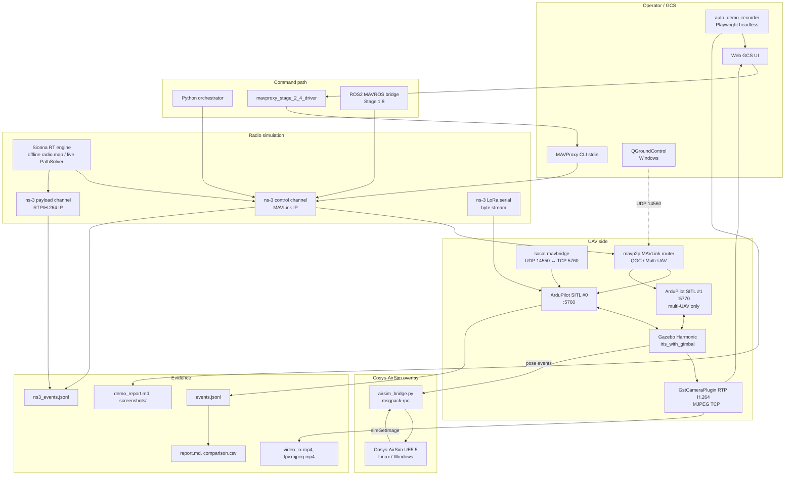

# Architecture — полная картина стенда

Этот документ описывает **как именно** устроен стенд: топология netns, ns-3
каналы, IPC между компонентами, lifecycle процессов. Если ищете высокоуровневое
описание для отчёта — смотрите [architecture.md](architecture.md).

## Четыре контура



## Топология netns + Docker

```
┌─────────────── HOST netns ──────────────────────────────────────────────┐
│                                                                         │
│  Python:                                                                │
│    .venv/bin/bas-orchestrator    ← в bas-ctrl-far netns через ip exec   │
│    .venv/bin/python gcs_web_ui_server.py                                │
│    sionna_env/bin/python sionna_channel_publisher.py                    │
│    .venv/bin/python airsim_bridge.py                                    │
│                                                                         │
│  Linux bridges:                                                         │
│    br-ctrl-near (10.10.0.99/24)   ── tap-ctrl-near ← ns-3 control       │
│    br-ctrl-far                    ── tap-ctrl-far ← ns-3 control        │
│    br-pload-near (10.20.0.99/24)  ── tap-pload-near ← ns-3 payload      │
│    br-pload-far                   ── tap-pload-far ← ns-3 payload       │
│                                                                         │
│  Host-side IP добавки (опционально):                                    │
│    10.10.0.254/24 на br-ctrl-near  ← для FPV/QGC доступа в bas-uav      │
│                                                                         │
│  ns-3 containers (network: host):                                       │
│    bas-ns3-stage24                ← запускает two_channel.cc            │
│    bas-ns3-stage17                ← запускает lora_serial.cc            │
└─────────────────────────────────────────────────────────────────────────┘
                                       │
                                       │ veth pairs
                                       ▼
┌─────────── bas-uav netns (Kubernetes pause pattern) ────────────────────┐
│  eth0 = 10.10.0.2/24 → br-ctrl-near                                     │
│  eth1 = 10.20.0.2/24 → br-pload-near (Stage 1.5.2 video)                │
│                                                                         │
│  Контейнеры shared netns:                                               │
│    bas-uav-net     ← pause sleep infinity                               │
│    bas-gazebo      ← Gazebo Harmonic, FDM 9002/9003                     │
│    bas-sitl        ← ArduCopter -I0 sysid=1 TCP 5760                    │
│    bas-sitl2       ← ArduCopter -I1 sysid=2 TCP 5770 (multi-UAV only)   │
│    bas-mavbridge   ← socat UDP4-LISTEN:14550 ↔ TCP4:127.0.0.1:5760      │
│    bas-mavrouter   ← mavp2p tcpc:5760 + udps:14550 + udps:14560 (QGC)   │
│    bas-mavrouter-multi ← mavp2p tcpc:5760 + tcpc:5770 + udps:14550      │
│    bas-fpv-mjpeg   ← gst-launch udpsrc:5600 → multipart MJPEG TCP 8766  │
│    bas-video-sender / receiver  ← Stage 1.5.2 RTP H.264                 │
│    bas-lora-uav-bridge          ← socat UNIX ↔ TCP 5760 (LoRa stage)    │
└─────────────────────────────────────────────────────────────────────────┘
                                       │
                                       │ ns-3 simulated radio
                                       ▼
┌─────────── bas-ctrl-far netns ──────────────────────────────────────────┐
│  IP = 10.10.0.x через tap-ctrl-far (ns-3 endpoint)                      │
│  Запускается ip netns add вне Docker, не container'ом.                  │
│  Содержит:                                                              │
│    bas-orchestrator        ← orchestrator/mission runners               │
│    mavproxy_stage_2_4_driver.py  ← MAVProxy stdin source-of-truth       │
└─────────────────────────────────────────────────────────────────────────┘

┌─────────── bas-pload-far-pod netns (Stage 1.5.2 only) ──────────────────┐
│  eth = 10.20.0.3/24 → br-pload-far                                      │
│    bas-pload-far-net  ← pause                                           │
│    bas-video-receiver ← GStreamer udpsrc:5000 → mp4                     │
└─────────────────────────────────────────────────────────────────────────┘
```

## IPC paths

### Через ns-3 control channel (MAVLink)

```
[bas-ctrl-far] MAVProxy stdin
   ↓ udpout:10.10.0.2:14550 (MAVLink2 UDP)
   ↓ TapBridge → tap-ctrl-far → ns-3 CSMA → tap-ctrl-near → br-ctrl-near
   ↓
[bas-uav] eth0:14550 (mavbridge socat UDP listen)
   ↓ TCP4:127.0.0.1:5760
SITL TCP server :5760
```

ns-3 `two_channel.cc` deformирует канал через:
- `RateErrorModel.ErrorRate` (loss_ratio)
- `CsmaChannel.Delay` (extra_delay_ms)
- `outage_begin/end` schedule

Это применяется к одному из: `control`, `payload`, **`control+payload`**
(see `--sionnaTargetFlow=both`).

### Через ns-3 payload channel (RTP/H.264 video)

```
Gazebo iris_with_gimbal GstCameraPlugin
   ↓ RTP H.264 UDP 127.0.0.1:5600 (loopback в bas-uav netns)
[bas-uav] bas-video-sender (gst-launch)
   ↓ UDP 10.20.0.3:5000 через eth1 → br-pload-near → tap-pload-near
ns-3 payload channel (deformируется RateErrorModel)
   ↓ tap-pload-far → bas-pload-far-pod eth
[bas-pload-far-pod] bas-video-receiver (gst-launch)
   ↓ rtph264depay + avdec_h264 + mp4mux + filesink
logs/<run>/video_rx.mp4
```

### LoRa Serial path (Stage 1.7)

```
[host] orchestrator
   ↓ pymavlink serial:/tmp/ptyGCS_lora
[host] socat PTY ↔ UNIX socket /tmp/bas-bridge/lora-gcs.sock
   ↓
[bas-ns3-stage17] container socat UNIX socket ↔ ns-3 GCS PtyApp
   ↓
ns-3 lora_serial.cc PointToPoint (PHY-calibrated SX1276 SF7/BW125, data_rate=5470 bps)
   ↓
ns-3 UAV PtyApp ↔ container socat ↔ UNIX socket /tmp/bas-bridge/lora-uav.sock
   ↓
[bas-uav] bas-lora-uav-bridge (socat UNIX ↔ TCP)
   ↓
SITL primary serial TCP 5760
```

**Никакого IP-stack в радиопетле** — это требование ТЗ ("LoRa через Serial Port").

### MAVROS path (Stage 1.8)

```
[bas-uav] SITL TCP 5760 (single client)
   ↑ mavros_node TCP client + ROS2 topics/services
[bas-uav] bas-mavros container (ROS2 humble + MAVROS 2.14 + bas_mavros_bridge.py)
   ↓ rclpy service calls:
     /mavros/set_stream_rate (StreamRate)
     /mavros/mission/push (WaypointPush)
     /mavros/set_mode (SetMode)
     /mavros/cmd/command (CommandLong) — force-arm + MISSION_START
```

`bas_mavros_bridge.py` пишет в `events.jsonl` с `component=mavros`. WaypointList
sub из MISSION_CURRENT даёт `waypoints_reached`. Поскольку Stage 1.8 не через
ns-3 control (MAVROS подключается напрямую к SITL TCP), радиоканал не
деформируется в этом сценарии.

### QGC bridge (Stage 2.4 QGC)

```
[Windows] QGroundControl
   ↓ UDP 14560 to WSL eth0 IP
[host] socat UDP4-LISTEN:14560 → UDP4:10.10.0.2:14560
[bas-uav] mavp2p tcpc:5760 + udps:14550 + udps:14560
   ↓ TCP 5760
SITL

Одновременно MAVProxy идёт через ns-3:
[bas-ctrl-far] MAVProxy → ns-3 control → bas-uav:14550 → mavp2p → SITL
```

Оба GCS (Web GCS через MAVProxy + QGC) видят SITL одновременно с разными
sysid'ами.

### AirSim overlay (Stage 2.2)

```
[bas-uav] Gazebo iris pose → events.jsonl flight events (lat, lon, alt, heading)
   ↓
[host] airsim_bridge.py (tail events.jsonl)
   ↓ haversine lat/lon → NED (x_north, y_east, z_down=-alt)
   ↓ msgpack-rpc simSetVehiclePose(Pose, vehicle_name="")
   ↓
[Windows/Linux] Cosys-AirSim UE5.5
   ↓ rendering iris/Copter в той же pose
   ↑ simGetImage("front_center", Scene) → PNG bytes
[host] airsim_bridge.py → logs/<run>/airsim_camera/frame_NNN.bin
```

## Lifecycle процессов

### Запуск (run_stage_2_4_*_demo.sh wrapper)

1. **`ensure_root()`** — проверка sudo
2. **`ensure_docker()`** — docker daemon up
3. **`kill_stale_ui()`** — выключить старый gcs_web_ui_server на 8765 (preflight)
4. **`trap cleanup EXIT INT TERM`** — гарантированная очистка
5. **`setup_radio_net.sh up`** — создать bridges (br-ctrl-near, br-pload-near)
   + netns bas-ctrl-near + bas-ctrl-far + taps
6. **`docker compose up uav-net`** — pause контейнер для bas-uav netns
7. Inject veth: `ip link add veth-uav type veth peer name veth-uav-br`,
   move в bas-uav, addr add 10.10.0.2/24
8. **`docker compose up gazebo`** + sleep 6с (FDM ready)
9. **`docker compose up sitl mavbridge`** (или `sitl mavrouter` в QGC mode,
   или `sitl sitl2 mavrouter-multi` в Multi-UAV mode)
10. Wait `ss -tln | grep :5760` — SITL ready
11. **`start_fpv_pipeline()`** — `bas-fpv-mjpeg` контейнер если BAS_GCS_FPV=1
12. **`start_qgc_host_relay()`** — host-side socat 14560 → 10.10.0.2:14560
13. **`start_sionna_rt_publisher()`** — фоновый publisher если BAS_SIONNA_RT_ONLINE=1
14. **`start_airsim_overlay()`** (отдельный wrapper run_stage_2_2_*) —
    stub/linux/windows mode
15. **`docker run ns-3 stage24`** — `two_channel.cc` с CLI args
16. Wait `ns3_events.jsonl` first event
17. Запуск UI / interactive / smoke mode:
    - `ui`: `gcs_web_ui_server.py` (HTTP :8765) с child MAVProxy в bas-ctrl-far
    - `interactive`: MAVProxy CLI stdin в bas-ctrl-far
    - `smoke`: scripted command sequence без интерактива

### Завершение (trap cleanup)

1. **kill_stale_ui** на UI порту (наш Python)
2. Стопнуть QGC host-side socat (`/tmp/bas_qgc_socat.pid`)
3. Стопнуть Sionna RT publisher (`/tmp/bas_sionna_rt.pid`)
4. `docker rm -f` ns-3 + fpv + mavrouter + sitl2 containers
5. `docker compose down -v` со всеми profile (fpv, qgc, multi)
6. `ip addr del 10.10.0.254/24 dev br-ctrl-near` (FPV host route)
7. `ip link del veth-uav-br` + `umount` netns symlinks
8. **`setup_radio_net.sh down`** — bridges + taps + netns down

## Точки синхронизации

| Что | Где синхронизируется |
|---|---|
| Gazebo FDM ↔ SITL | UDP 127.0.0.1:9002/9003 (JSON FDM) — каждые ~1 мс |
| SITL ↔ MAVLink client | TCP 5760, single-client; либо mavp2p multi |
| ns-3 ↔ network stack | TapBridge UseLocal mode, real-time scheduler |
| Sionna live ↔ ns-3 | `/tmp/bas_stage24_rt.json` polling 100мс |
| Web UI ↔ MAVProxy | subprocess.Popen + stdin/stdout pipes (синхронно) |
| AirSim bridge ↔ AirSim | msgpack-rpc TCP 41451 (blocking calls) |
| FPV bridge ↔ Web UI | multipart/x-mixed-replace HTTP stream |

## Источники документации

- [architecture.md](architecture.md) — высокоуровневая схема для отчётности
- [stage_X_Y_*.md](.) — планы и known issues каждого этапа
- [stage_2_4_manual_gcs.md](stage_2_4_manual_gcs.md) — детали Web GCS + MAVProxy
- [stage_2_4_qgc_setup.md](stage_2_4_qgc_setup.md) — детали QGC bridge
- [stage_2_2_airsim_overlay.md](stage_2_2_airsim_overlay.md) — детали AirSim
- [stage_2_1_sionna_plan.md](stage_2_1_sionna_plan.md) — Sionna RT pipeline
- [stage_1_8_mavros_plan.md](stage_1_8_mavros_plan.md) — MAVROS backend
- [stage_1_7_lora_serial_plan.md](stage_1_7_lora_serial_plan.md) — LoRa Serial
- [stage_1_5_2_plan.md](stage_1_5_2_plan.md) — RTP video pipeline
- [stage_1_5_1_known_issues.md](stage_1_5_1_known_issues.md) — WSL2 race conditions
