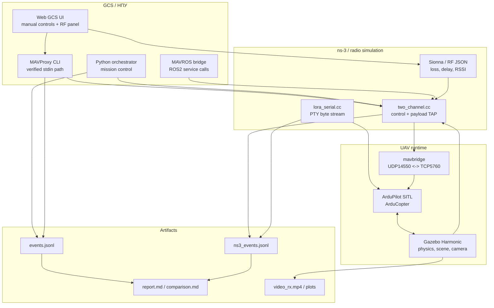

# Итоговая архитектура прототипа

Этот документ фиксирует фактическое состояние репозитория после закрытия личной
зоны Физулина А.В. по моделированию БАС, каналам связи, MAVROS, ns-3/Sionna и
ручному управлению одним БАС.

## Что построено

Прототип объединяет четыре контура:

1. **Полётный контур** — Gazebo Harmonic + `ardupilot_gazebo` + ArduPilot SITL.
2. **Командный контур** — orchestrator, MAVProxy GCS или MAVROS backend.
3. **Сетевой контур** — ns-3 realtime с control/payload каналами, outage/loss,
   LoRa Serial и dynamic channel hook.
4. **Доказательный контур** — JSONL события, Markdown/CSV отчёты, видео и plots.

## Командные пути

| Путь | Компоненты | Назначение | Статус |
|---|---|---|---|
| `pymavlink` mission | orchestrator -> ns-3 control -> mavbridge -> SITL | AUTO mission, базовый acceptance | Готово |
| MAVProxy GCS | Web UI / driver -> MAVProxy stdin -> ns-3 -> SITL | Ручное управление Stage 2.4 | Готово |
| MAVROS | ROS2/MAVROS bridge -> ns-3 -> SITL | Проверка ROS-based path из ТЗ | Готово |
| LoRa Serial | host PTY -> ns-3 byte stream -> UAV bridge -> SITL | MAVLink без IP-stack в радио-петле | Готово |

Stage 2.4 намеренно использует MAVProxy как GCS backend. Прямой `pymavlink`
в ручном Web UI не используется как источник flight-команд.

## Сетевые каналы

### `two_channel.cc`

Основной ns-3 сценарий для IP/TAP режимов:

- `control` канал: MAVLink commands/telemetry;
- `payload` канал: RTP/H.264 video и payload эксперименты;
- параметры: delay, loss, outage windows, jitter/goodput/PDR metrics;
- dynamic JSON hook для Sionna/RF channel updates.

### `lora_serial.cc`

Отдельный сценарий для буквального LoRa Serial требования:

- host-side PTY для GCS;
- container-side PTY/UNIX socket bridge;
- byte stream через ns-3, без IP-stack в радиопетле;
- PHY-calibrated PointToPoint режим под Semtech SX1276;
- legacy signetlabdei/lorawan baseline сохранён в
  `ns3/scenarios/lora_serial_lorawan.cc`.

### Sionna RT / RF

В репозитории есть два связанных, но разных слоя:

1. **Sionna RT pipeline** — offline scene/radio map:
   `scene/iris_runway.xml`, `radio_maps/iris_runway.npz`,
   `scripts/compute_radio_map.py`, `scripts/sionna_channel_publisher.py`.
2. **Stage 2.4 RF/LOS live demo** — lightweight geometry model в Web GCS,
   видимые препятствия в Gazebo, live LOS/NLOS/RSSI/loss/delay график,
   channel JSON для ns-3 polling.

Важно: live RF/LOS demo сделан для наглядного видео и операторского UI. Это не
полноценный real-time ray tracing каждым кадром. Полноценная Sionna часть
существует как воспроизводимая offline radio-map pipeline и synthetic/dynamic
channel hook.

## Полётный контур

Gazebo и SITL работают в shared namespace (`bas-uav`) по pause-container
pattern. Это позволяет:

- держать Gazebo/SITL FDM локально и стабильно;
- выводить наружу только моделируемые каналы;
- подключать `mavbridge` внутри BAS-side namespace;
- запускать headless acceptance или Gazebo GUI через WSLg.

Для видео используется либо `videotestsrc`, либо штатная Gazebo POV camera на
модели `iris_with_gimbal`.

## Доказательный контур

Каждый запуск создаёт `logs/<run_id>/`. Основные файлы:

| Файл | Смысл |
|---|---|
| `events.jsonl` | События orchestrator / GCS / MAVLink |
| `ns3_events.jsonl` | ns-3 tx/rx/drop/outage/channel update events |
| `report.md` | Итоговый отчёт по одному прогону |
| `comparison.md`, `comparison.csv` | Сравнение WiFi/LoRa или других пар прогонов |
| `mavproxy_stdout.log` | Реальный вывод MAVProxy |
| `operator_ui_manifest.json` | Конфигурация Web GCS запуска |
| `video_rx.mp4` | Принятый payload video |

Analyzer считает flight metrics, PDR, loss, jitter, goodput, video FPS,
frame loss, e2e latency approximation и outage correlation.

## Этапы

| Этап | Содержание | Состояние |
|---|---|---|
| 1.0-1.4 | Skeleton, Docker, SITL+Gazebo, ns-3 TapBridge, MAVLink без ns-3 | Готово |
| 1.5.0 | Shadow GCS в `bas-ctrl-far` через ns-3 | Готово |
| 1.5.1 | Mission через ns-3 control, `wifi_good` и `degraded_lora` | Готово |
| 1.5.2 | RTP/H.264 payload, Gazebo camera, video metrics, outage correlation | Готово |
| 1.6 | Сравнительный отчёт WiFi vs LoRa | Готово |
| 1.7 | LoRa через Serial Port без IP-stack | Готово |
| 1.8 | ROS2/MAVROS backend | Готово |
| 2.1 | Sionna RT offline radio map + dynamic channel hook | Готово |
| 2.4 | Web GCS / MAVProxy ручное управление одним БАС | Готово |
| 2.4 RF | Gazebo obstacles + live LOS/NLOS/RSSI graph | Готово |
| 2.2 | AirSim overlay над Gazebo физикой | Не реализовано в этом репозитории |
| 2.3 | Multi-UAV / swarm | Не реализовано в этом репозитории |

## Stub vs real

Stub-режим в orchestrator оставлен для быстрой отладки логики сценариев и
анализатора без Docker/Gazebo/ns-3. Acceptance и демонстрационные прогоны
используют real-mode runners из `scripts/`.

## Известные ограничения

- RF/LOS live demo не является полным online Sionna ray tracing.
- Stage 2.4 закрыт через Web GCS + MAVProxy, QGroundControl не запускался как
  acceptance-клиент.
- Multi-UAV и AirSim overlay оставлены как backlog/чужая зона.
- Полная ИССГР объектная БД, REST/OGC API и CV-обработка видовых данных шире
  текущего моделирующего стенда.
